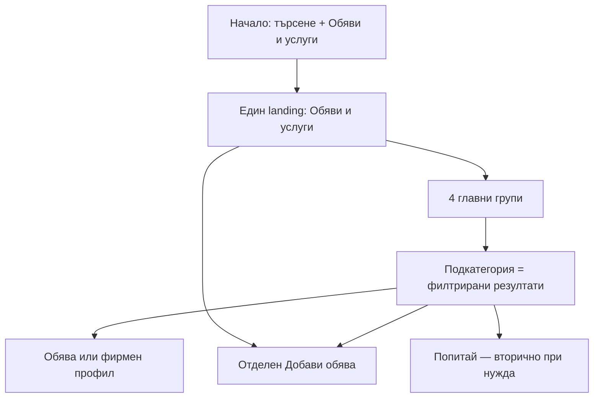

# Попитай.Лом — V6 CANONICAL RECOVERY

Статус: **RECOVERY PACKAGE READY FOR USER REVIEW / NO IMPLEMENTATION / NO PRODUCTION CHANGE**
Branch: `v6-product-foundation-draft`
Проверен prototype baseline: `9add22055dfa663f585a48f094585d5bedced766`
Актуализирано: 02.09.2026

## 1. ЦЕЛ И FREEZE

Този документ възстановява една продуктова истина след отклонението на V6 prototype. Той не започва проекта отначало и не отменя работещата production основа.

До изрично приемане на Recovery пакета:

- не се започва V18 или нов visual layer;
- не се пише production UI/backend/schema/RLS код;
- не се merge-ва V6 към `main`;
- не се променят категории, owners, роли, права, лимити, статуси, moderation или protected ranking;
- не се изтриват стари документи или prototype файлове;
- стар V6 документ не е самостоятелно разрешение за имплементация;
- V6-C не е приет и няма доказан browser/rendered PASS за head `9add220`.

Production `main` не е променен от V6. V6 implementation остава изолиран в `v6-prototype/`.

## 2. AUTHORITY И РАЗРЕШЕНИ ПРОТИВОРЕЧИЯ

При конфликт важи:

1. `PROJECT_RULES_00_READ_FIRST.md`;
2. `PROJECT_RULES_PROTECTED_CORE.md`;
3. `PROJECT_RULES_ADMIN_MODERATOR.md`;
4. `PROJECT_RULES.md`;
5. `PROJECT_RULES_RENDER_OWNERSHIP.md`;
6. `PUBLIC_MARKETPLACE_V3_APPROVED_SPEC.md`;
7. приложимите непротиворечащи решения от `PUBLIC_SITE_INFORMATION_ARCHITECTURE_APPROVED_SPEC.md`;
8. последното ясно одобрено решение на собственика;
9. този документ и `PUBLIC_PRODUCT_V6_IMPLEMENTATION_MATRIX.md`;
10. останалите V6 документи само според `PUBLIC_PRODUCT_V6_DOCUMENT_INDEX.md`;
11. prototype code никога не отменя договор само защото е по-нов.

Разрешени конфликти:

| Конфликт | Канонично решение |
|---|---|
| Marketplace V3 има 4 главни групи, B1 по-късно предлага 16 равни категории | Запазват се **4 главни marketplace групи**. Полезните 16 тематични връзки се използват само като shortcuts/cross-links към правилния owner, не като второ дърво. |
| Marketplace V3 казва един landing, prototype има `categories` и `marketplace` screen | Остава един landing `Обяви и услуги`. `kategorii.html` е compatibility вход. Prototype `categories` screen отпада при бъдеща consolidation. |
| V3 казва category card = navigation, prototype отваря `form-listing` | Category/subcategory card отваря browse/filter results. Отделният `Добави обява` CTA отваря формата с bounded context. |
| Protected form има 4 public групи, prototype показва 6 (`work`, `property` отделно) | Формата показва точно 4 групи. `Работа` и `Имоти` са под `Други обяви` и запазват specialized protected types. |
| По-стари deep pages съдържат по два Add бутона под всяка карта | Runtime V3 вече ги заменя с navigation + един category Add. Не се връща старият модел. |
| Generic V6 visual shell срещу одобрено Info/Health поведение | Info Lom и Health са preserve-first specialized surfaces. Generic V6 не ги редизайва и не добавя click depth. |

## 3. ПРОДУКТОВ МОДЕЛ В ЕДНО ИЗРЕЧЕНИЕ

**Попитай.Лом е местен портал с водещ вход „Обяви и услуги“, където човек първо намира или добавя реална обява/услуга; фирмите, проверената информация, магазините, събитията, статиите и Q&A остават свързани, но при собствените си authoritative owners.**

Водещото не е „въпроси навсякъде“. Q&A остава полезна community памет, но се показва след готовите резултати, при true no-result или в ясно вторичен контекст.

## 4. GLOBAL NAVIGATION

Desktop:

`Начало | Обяви и услуги | Фирми | Инфо Лом | Статии | Още ▼ | Профил | + Добави`

`Още` съдържа `Въпроси`, `Събития`, `За сайта`, `Правила`, `Контакти`.

Mobile bottom navigation — точно пет позиции:

`Начало | Обяви | + | Инфо | Профил`

Няма отделен top-level `Категории`. Няма едновременно `Категории` и `Обяви`. Няма дублиран `Вход` до `Профил`.

## 5. КАНОНИЧЕН SCREEN FLOW

Основното правило е:

`разглеждам → избирам група → избирам подкатегория → виждам резултати`

и отделно:

`Добави обява → Предлагам/Търся → група → подкатегория → protected form`

Подкатегорията никога не е скрит Add бутон.

## 6. НАЧАЛНА СТРАНИЦА

Каноничен ред:

1. compact header + основно търсене `Какво търсиш в Лом?`;
2. водещ блок `Обяви и услуги` с четирите главни групи и един `Добави обява`;
3. малък блок с реални актуални обяви/услуги, зареден ограничено;
4. `Открий в Лом` — Фирми, Магазини, Заведения, Събития;
5. `Инфо Лом` — проверена информация и директни задачи;
6. само `ПРОВЕРЕНО ГОТОВО` ръководства;
7. полезни одобрени въпроси/отговори като вторично community съдържание.

Home не показва 16 равни category карти и не прави `Задай въпрос` primary hero action.

Mobile first view:

- search;
- кратко заглавие `Обяви и услуги`;
- четирите групи в компактна 2×2 подредба;
- един видим `Добави обява`;
- без всички 32 leaf категории на първия екран.

## 7. `ОБЯВИ И УСЛУГИ` LANDING

Canonical URL: `obyavi.html`.

Above the fold:

1. breadcrumb;
2. H1 `Обяви и услуги`;
3. кратко обяснение без маркетингов шум;
4. search `Какво търсиш?`;
5. един primary CTA `Добави обява`;
6. четири ясни group cards:
   - Майстори и ремонти;
   - Автомобили;
   - Други услуги;
   - Други обяви.

След тях:

- `Всички категории` е secondary progressive disclosure, групирано под същите четири headings;
- активни резултати;
- content-type label `Обява` или `Фирма`;
- filters/sort, когато са приложими;
- true empty state с `Добави обява`, промяна на филтъра и secondary `Попитай`.

Няма flat списък от raw database category стойности като главна IA.

## 8. ЧЕТИРИ ГЛАВНИ ГРУПИ

### 8.1 Майстори и ремонти

Leaves:

`Цялостни ремонти · Бани и плочки · ВиК · Електро · Покриви · Боядисване · Дограма · Климатици`

Deep view: `maistori.html`.

Read composition:

- approved active service Listings;
- relevant approved Firms;
- protected Construction/Masters/Ivanov presentation and priority after relevance;
- Q&A/Articles само secondary.

### 8.2 Автомобили

Leaves:

`Автомобили за продажба или търсене · Авточасти · Автосервизи · Диагностика · Гуми · Автомивки · Пътна помощ`

Deep view: `avtomobili.html`.

Автомобилите използват protected category `Автомобили и МПС`. Автомобилните услуги използват protected `Услуги + exact subcategory`.

### 8.3 Други услуги

Leaves:

`Домашна помощ · Красота и грижа · Компютърни и технически услуги · Фото и видео · Професионални услуги · Обучение и уроци · Грижа · Транспорт, преместване и доставки`

Deep view: `rabota.html` като compatibility URL с visible meaning `Други услуги`.

`Работа` не е част от тази група.

### 8.4 Други обяви

Leaves:

`Електроника · Дом и градина · Дрехи и обувки · Деца и бебета · Спорт и хоби · Животни · Работа · Имоти · Друго`

Deep state: `obyavi.html?main=other`.

`Работа` и `Имоти` използват protected specialized listing type полета и semantics.

Пълното public→stored mapping е в `PUBLIC_PRODUCT_V6_IMPLEMENTATION_MATRIX.md`.

## 9. DEEP GROUP И SUBCATEGORY PRESENTATION

Общ shell, без механично уеднаквяване на owner-specific съдържание:

1. breadcrumb към `Обяви и услуги`;
2. group title и кратко обяснение;
3. group search;
4. един contextual `Добави обява`;
5. subcategory cards/chips — само navigation/filter;
6. filters `Всички | Предлагат | Търсят | Фирми`, само когато са приложими;
7. реални approved/active резултати;
8. secondary guides/Q&A след резултатите.

Desktop:

- subcategories могат да бъдат видими в 2–4 колони;
- result list/grid започва веднага след navigation/filter блока;
- sidebar се допуска само ако помага на търсенето и не дублира основните действия.

Mobile:

- показват се приоритетните 4–5 leaves;
- `Покажи всички` отваря останалите в същия контекст чрез accordion/sheet;
- няма по два бутона под всяка leaf карта;
- active leaf остава видим и има `aria-current`;
- result list започва без огромна празна hero зона.

## 10. ЕДИН ЗАПИС, НЯКОЛКО КОНТЕКСТА

Една обява се съхранява точно веднъж от Listings owner.

Пример:

- обява `Полагане на плочки` се пази като `Услуги + Бани и плочки`;
- може да се покаже в `Обяви и услуги`, `Майстори и ремонти`, search и свързана фирма;
- не се копира в отделна таблица `Майстори` или `Услуги`.

Фирменият профил е отделен permanent entity и също не се копира в Listings. Category results могат да покажат и `Обява`, и `Фирма`, но картата винаги казва какъв тип е резултатът.

Това премахва видимото усещане за „шест вида услуги“:

- `Майстори и ремонти` = service discovery group;
- автомобилните услуги = част от `Автомобили`;
- `Други услуги` = останалите service Listings;
- `Фирми` = постоянни профили, не четвърта service форма;
- `Комунални и ежедневни услуги` в Info Lom = проверена справочна информация, не marketplace;
- raw stored category `Услуги` остава техническа compatibility стойност и не се показва като пета публична група.

## 11. ADD FLOW

### 11.1 Global `+ Добави`

Default options:

1. `Добави обява`;
2. `Добави фирма`;
3. `Задай въпрос`.

Specialized actions се показват в собствения owner context:

- Health → `Добави лекар или здравна услуга` чрез Health/Info submission owner;
- Shops → `Добави магазин` чрез Shops owner;
- Info → `Предложи корекция/Сигнализирай грешка`;
- Events → няма public Add;
- Articles → няма public Add.

### 11.2 Listing form

Public create order:

1. `Предлагам` / `Търся`;
2. една от четирите главни групи;
3. exact bounded subcategory;
4. existing protected listing details.

Contextual `Добави обява` може да prefill-не group/subcategory. Prefill е видим и editable. Не задава permission/status/owner. `edit=<id>` винаги има приоритет.

Формата не показва `Работа` и `Имоти` като пета и шеста главна група. Те са leaves под `Други обяви`; след избор се показват protected specialized types.

### 11.3 Firm form

`Добави фирма` означава постоянен местен профил. Не се смесва с временно service offer. Bounded category prefill се допуска само когато е реално mapping-нат и видим; непознат URL param не се записва.

## 12. FORMS, ROLES И LIFECYCLE

Protected business rules остават непроменени.

| Роля/flow | Create result | Edit result | Ограничения |
|---|---|---|---|
| Normal listing/firm | Изпратено за преглед | Редакцията е изпратена; последната approved версия остава public | Quotas/media/protected validation остават |
| Moderator own listing/firm | Същото като normal | Същото като normal | Без self-approval, direct publish или Admin options |
| Admin listing/firm | Публикувано според protected owner | Запази и публикувай | Само съществуващите Admin exceptions |

Всеки write flow има:

- точен context и owner;
- inline validation + видим error summary;
- preservation на въведеното при validation/network error;
- dirty-leave guard за дълги content форми;
- submit lock срещу double submit;
- explicit pending/public success receipt;
- form body се заменя с completed receipt след потвърден success;
- accessible focus/live-region поведение;
- следващо логично действие.

Form coverage включва Listings create/edit, Firms create/edit/expanded, Question, Answer, Health add/correction/signal, Shop proposal, Info correction, Report, Contact, Login, Registration, Forgot и Reset password.

Точната QA матрица остава в `PUBLIC_PRODUCT_V6_C_FORM_LIFECYCLE_AUDIT_MATRIX.md`; тя е task-specific acceptance source, не разрешение за нов owner.

## 13. SPECIALIZED OWNERS

### Info Lom и Health

- preserve-first;
- шестте Info families остават директни;
- Health остава specialized verified dataset;
- съществуващите sticky tabs, priority cards, emergency/contact actions, source/freshness и click depth не се редизайват generically;
- частни лекари/практики се добавят само чрез current specialized Health submission flow;
- community мнение не става verified Health факт.

### Shops

- specialized Shops owner;
- `Добави магазин` остава local modal/form;
- не се route-ва към generic Firm/Listing;
- tabs/tags/classification се запазват.

### Restaurants

- read/add остава върху Firms owner с category `Заведения`;
- няма втори restaurant datastore;
- няма booking/payment promise.

### Events

- read-only public discovery на approved current/upcoming events;
- няма fake `Добави събитие`;
- public submit изисква отделно owner/form/moderation решение.

## 14. SEARCH, Q&A, ARTICLES И RECOMMENDATIONS

### Search

- един explicit Search owner;
- Supabase-backed owner queries, не localStorage/static-only truth;
- result families ясно обозначават Info, Firm, Listing, Shop, Event, Q&A и Guide;
- relevance преди protected priority;
- partial owner failure не се показва като false no-result;
- true no-result предлага промяна на търсенето, applicable Add и secondary contextual `Попитай`.

### Q&A

- secondary community knowledge owner;
- canonical/duplicate suggestion не прави destructive auto-merge;
- pending/hidden Q&A не е public;
- community answer не се обозначава като verified Info;
- category/search context може bounded да prefill-не Ask form.

### Articles

- само `ПРОВЕРЕНО ГОТОВО` се показва като готов guide;
- mutable facts остават при Info/other authoritative owner;
- guide свързва към актуалния owner, не копира phone/hours като вечна истина.

### Recommendations

- relation идва само от eligible approved source;
- няма fake stars, `най-препоръчван` или ranking boost без методология и отделно одобрение;
- protected Ivanov/Admin priority остава след relevance.

## 15. FACEBOOK BRIDGE — ЗАДЪЛЖИТЕЛНО ЗАПАЗЕН

Product loop:

`Публикувай в Попитай → одобрено canonical съдържание → потребителят избира Сподели → Facebook носи reach → canonical URL връща към Попитай`.

Правила:

- Facebook е distribution, не data owner;
- pending/rejected/private content няма public share CTA;
- share сочи към един canonical Popitai URL;
- preferred chain: native Share → explicit Facebook share → Copy link/text → manual fallback;
- няма Facebook SDK по подразбиране;
- няма scraping, arbitrary group auto-posting, Facebook credential/session cookie или import на comments/reactions;
- Facebook→Popitai е user-assisted paste на собствен текст с visible suggested prefill и normal validation/moderation;
- media се re-upload-ва през правилния Popitai owner;
- external likes/comments не стават Q&A answers/recommendations;
- dynamic OG трябва да е server/edge readable и да не копира volatile/private facts;
- exact Meta endpoint се проверява отново непосредствено преди implementation.

## 16. ВЪНШНИ МОДЕЛИ — ВЗЕМАМЕ / АДАПТИРАМЕ / ОТХВЪРЛЯМЕ

Проверени официални public surfaces към 02.09.2026:

| Модел | Какво доказва | Вземаме | Адаптираме за Попитай.Лом | Не копираме |
|---|---|---|---|---|
| [OLX Bulgaria](https://www.olx.bg/) | Search + един `Добави обява` + главни категории + реални listings | Един marketplace landing, видим Add, categories като browse вход | Четири ясни групи вместо голям национален flat каталог; местни owner-aware резултати | Promo density, бизнес upsell, огромна равнопоставена category решетка |
| [Thumbtack](https://www.thumbtack.com/) | Task-first search и popular local pro categories | Естествен въпрос `Какво търсиш?`, бързи high-intent service входове | Резултатите включват и Listings, и Firms с ясен content label | Quote/lead marketplace, guarantees, bookings или review claims без backend |
| [Taskrabbit services](https://www.taskrabbit.com/services) | Service families + nested concrete tasks + featured tasks | Progressive disclosure: group → конкретна услуга | Само 22 approved service leaves + 1 vehicle entry + 9 other listing categories; mobile показва приоритет и `Покажи всички` | Стотици unbounded task pages, booking/hourly/payment flow |
| [Houzz professionals](https://www.houzz.com/professionals) | Search first, popular services, grouped all-professionals catalogue и provider results | Search + popular group shortcuts + grouped expansion + provider cards в същия discovery path | Firms и Listings остават отделни owners, но могат да се покажат заедно | Stars, verified hires, licensing, send-message or marketplace claims без доказан owner |

Изводът не е „копираме един сайт“. Комбинацията е:

- OLX clarity за browse/add;
- Thumbtack task-first language;
- Taskrabbit progressive grouping;
- Houzz provider composition и guides/Q&A като secondary layer;
- всички adapted към малък местен портал без измислени рейтинги, bookings или нови owners.

## 17. VISUAL SYSTEM

Целта е една разпознаваема система, не еднакви страници:

- shared shell, typography, spacing, buttons, cards, states и focus language;
- owner-specific Info/Health/Shops/Forms запазват необходимата структура;
- един primary action на viewport context;
- secondary actions имат по-ниска визуална тежест;
- no giant hero, no empty vertical space, no four equal outline buttons в един ред;
- cards са navigation surfaces, не button clusters;
- mobile uses progressive disclosure, not hidden functionality;
- copy е кратко, професионално и на естествен български;
- няма internal думи `owner`, `protected`, `runtime`, `verified hire` в public copy.

## 18. RENDER/PERFORMANCE ARCHITECTURE

- един renderer/lifecycle owner на root;
- не се наслагва V18 върху V17;
- бъдещата prototype задача първо консолидира V8–V17 в bounded active files;
- unused broken `full-site.js` се класифицира/премахва едва след coverage проверка;
- category/route/form mapping идва от един canonical dictionary;
- няма паралелни `categories`/`marketplace` trees;
- no MutationObserver patch chain като production architecture;
- mobile initial path няма all-owner mega-query;
- exact fields/limits/pagination/show-more;
- no heavy Facebook/AI/framework dependency за основния flow;
- CI трябва изрично да включи `v6-prototype/` преди prototype acceptance.

## 19. ПОТВЪРДЕНИ PROTOTYPE ОТКЛОНЕНИЯ

Текущият V17 prototype не е acceptance baseline, защото:

1. има отделен `categories` screen и втори marketplace category expansion;
2. category/subcategory buttons route-ват директно към `form-listing`;
3. 16 public IDs не са пълно mapping-нати към form groups;
4. listing form има шест, а не четири public groups;
5. default `Всички/Предлага/Търси` могат да попаднат като fake subcategory;
6. docs описват V2–V7, а active HTML зарежда V8/V9/V17 layers;
7. CSS е натрупан в много overriding layers, включително brittle positional selectors;
8. active JavaScript минава syntax проверка, но старият unused `full-site.js` не минава;
9. няма PR/status/workflow/browser evidence за head `9add220`;
10. V6-C не е приет.

## 20. RECOVERY И IMPLEMENTATION STAGES

### R0 — Documentation recovery

- full document index;
- canonical structure;
- implementation/acceptance matrix;
- Master/Progress/Handoff sync;
- user review.

### R1 — Prototype consolidation, само след approval

- един route/runtime/form lifecycle owner;
- един marketplace landing;
- exact four-group mapping;
- category cards browse, Add is separate;
- current Info/Health parity preserved;
- no new visual layer file.

### R2 — Rendered design review

- desktop + mobile screenshots/interaction;
- Home, landing, all 4 groups, representative subcategories, Add flow;
- normal/Moderator/Admin form states;
- Search success/empty/partial error;
- Info/Health/Shops parity;
- focus/loading/error/dirty/success.

### R3 — Technical design

- production file/owner map;
- route/dictionary consolidation;
- query budgets/index impacts;
- login return/security;
- OG/share edge strategy;
- migration plan only if proven necessary;
- protected regression plan.

### R4 — Incremental production implementation

Само през approved slices, PR, CI, merge и production runtime QA. Няма big-bang rewrite.

## 21. ACCEPTANCE GATES

Recovery може да стане `READY FOR USER REVIEW` само ако:

- всички 4 groups и leaves имат exact stored mapping/owner;
- всички 16 стари thematic concepts имат disposition и няма второ tree;
- every visible CTA има owner/destination/prefill/state;
- forms/roles/media/lifecycle coverage е отчетен;
- Facebook Bridge е отчетен;
- Info/Health/Shops/Events boundaries са отчетени;
- external pattern matrix е source-backed;
- Master, Progress, Handoff и Document Index не си противоречат;
- `git diff --check` и documentation cross-reference checks минават.

Prototype acceptance по-късно изисква:

- syntax/asset/reference checks;
- CI coverage за prototype;
- rendered desktop/mobile review;
- keyboard/focus/modal review;
- exact route/form mapping tests;
- protected regression matrix;
- no false PASS without real browser evidence.

## 22. STOP CONDITIONS

Спира се за owner решение само при действително ново бизнес решение за:

- роли/права/RLS/schema;
- ownership/status/approval/direct publish;
- limits/quotas/media;
- protected Firms/Listings/Masters/Admin/Ivanov behavior;
- нов write owner или нова форма;
- необратимо премахване на approved capability.

Остарял handoff, доказано prototype отклонение или конфликт с по-висок approved source не изисква ново „ОК“.
